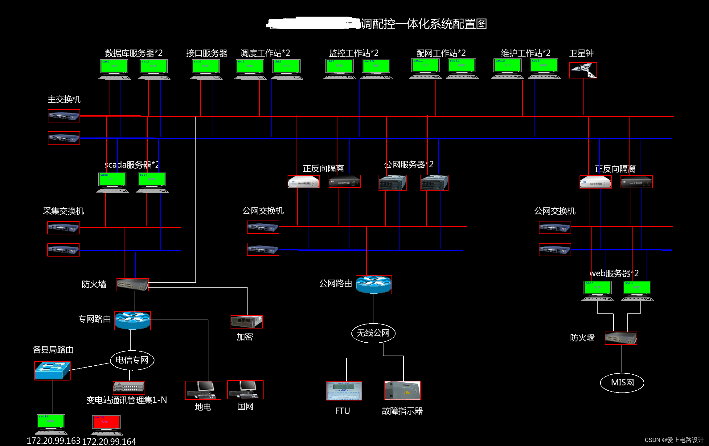

# SCADA系统

---

## 目录：

**一、概述**

**二、硬件**

**三、软件**

**四、系统配置图**

**1、馈线终端与主站(调度中心)**

**2、系统配置图**

**3、关于SCADA服务器**

---

## 一、概述

SCADA[s'k:d]（Supervisory[sju:p'vazr] Control and Data Acquisition[ækwzn]）系统，全名为数据采集与监视控制系统。在电力系统中，SCADA系统应用最为广泛，技术发展也最为成熟。它在远动系统中占重要地位，可以对现场的运行设备进行监视和控制，以实现数据采集、设备控制、测量、参数调节以及各类信号报警等各项功能,即我们所知的"四遥"功能。涉及到组态软件、数据传输链路（如：数传电台、GPRS等）。

SCADA系统是以计算机为基础的生产过程控制与调度自动化系统。它可以对现场的运行设备进行监视和控制。

---

## 二、硬件

通常SCADA系统分为两个层面，即**客户端/服务器体系结构。** 服务器与硬件设备通信，进行数据处理和运算。而客户用于人机交互，如用文字、动画显示现场的状态，并可以对现场的开关、阀门进行操作。

还有一种“超远程客户”，它可以通过Web发布在Internet上进行监控。硬件设备一般既可以通过点到点方式连接，也可以总线方式连接到服务器上。点到点连接一般通过​串口(RS232)，总线方式可以是RS485、以太网等连接方式。

## 三、软件/

SCADA由很多任务组成，每个任务完成特定的功能。位于一个或多个机器上的服务器负责数据采集，数据处理（如量程转换、滤波、报警检查、计算、事件记录、历史存储、执行用户脚本等）。服务器间可以相互通讯。有些系统将服务器进一步单独划分成若干专门服务器，如报警服务器，记录服务器，历史服务器，登录服务器等。

各服务器逻辑上作为统一整体，但物理上可能放置在不同的机器上。分类划分的好处是可以将多个服务器的各种数据统一管理、分工协作，缺点是效率低，局部故障可能影响整个系统。

四、系统配置图/

### **1、馈线终端与主站(调度中心)**

图4.1.1 馈线终端与主站(调度中心)连接

### **2、系统配置图**

图4.2.1 调配控一体化配置图

### **3、关于SCADA服务器**

**图4.3.1 西安通信过程**

图4.3.2 基站

物理隔离装置就是现在大家所说的网闸。**安全隔离网闸**是一种由带有多种控制功能专用硬件在电路上切断网络之间的链路层连接，并能够在网络间进行安全适度的应用数据交换的网络安全设备。

物理隔离装置与防火墙的区别：

防火墙一般在进行IP包转发的同时，通过对IP包的处理，实现对TCP会话的控制，但是对应用数据的内容不进行检查。这种工作方式无法防止泄密，也无法防止病毒和黑客程序的攻击。

无论从功能还是实现原理上讲，安全隔离网闸和防火墙是完全不同的两个产品，防火墙是保证网络层安全的边界安全工具（如通常的非军事化区），而安全隔离网闸重点是保护内部网络的安全。因此两种产品由于定位的不同，因此它们之间不能相互代替。
